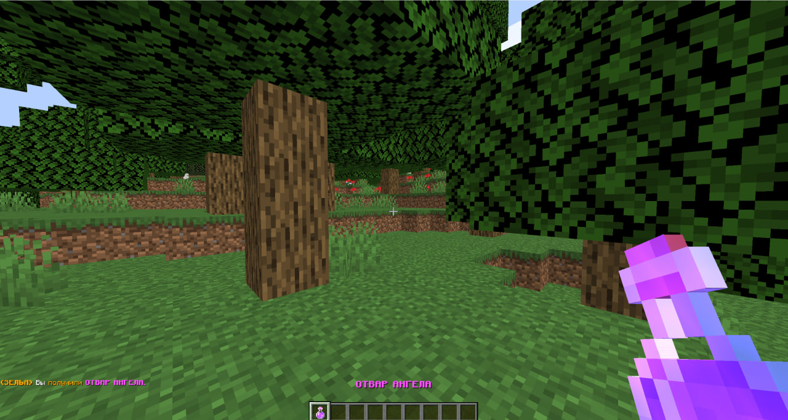
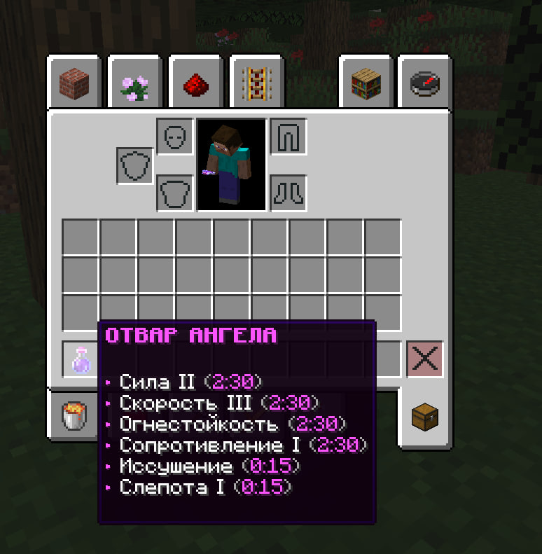
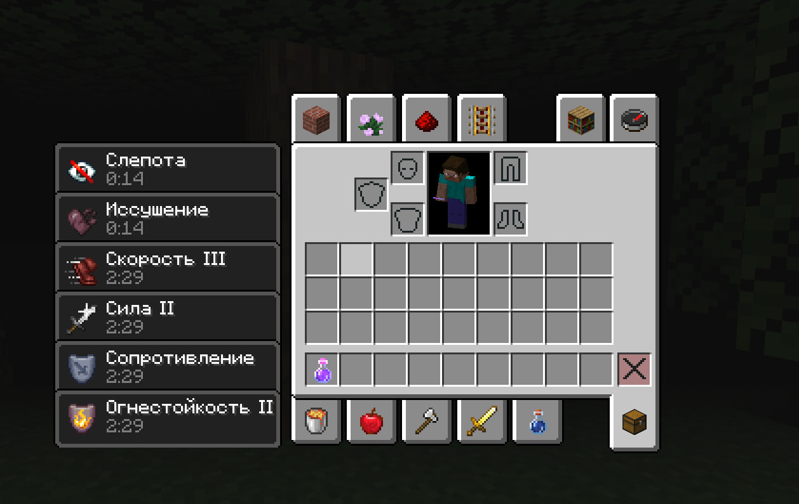

# PotionZZ - Уникальные зелья для Minecraft

**PotionZZ** — это Minecraft плагин, который позволяет выдавать кастомные зелья с уникальными эффектами. Используйте этот плагин, чтобы добавить больше разнообразия и возможностей для игроков на вашем сервере!

---

## Возможности

-   **Уникальные зелья**: Настраиваемые зелья с разнообразными эффектами, такими как здоровье, скорость, невидимость, урон и многое другое.
-   **Простая команда**: Легкий способ выдать кастомное зелье через `/zpotion`.
-   **Настраиваемые права доступа**: Управляйте правами на команды для игроков и ролей.
-   **Поддержка конфигурации**: Легко настраивайте эффекты зелий, цвет, атрибуты и другие параметры в файле конфигурации.

---

## Установка

1. Скачайте последнюю версию плагина **PotionZZ**.
2. Переместите `.jar` файл в папку `plugins` вашего сервера Minecraft.
3. Перезапустите сервер для активации плагина.
4. Настройте конфигурацию в `config.yml` по своему желанию.

---

## Команды и Права

### Команды

-   **`/zpotion give <ник> <зелье>**
    -   Выдает указанное зелье игроку.
    -   **Пример**: `/zpotion give Player1 healing` выдаст игроку Player1 зелья исцеления.

### Права доступа

-   **`zpotion.give`**
    -   Позволяет игроку использовать команду `/zpotion give`.
    -   Используйте это право для администраторов и модераторов, чтобы они могли выдавать зелья на сервере.

---

## Конфигурация

Плагин **PotionZZ** позволяет гибко настраивать каждый аспект зелий. Ниже пример конфигурации:

```yaml
messages:
    no_permission: '&cУ вас нет прав для использования этой команды!'
    usage: '&eИспользование: /zpotion give <игрок> <зелье> <кол-во>'
    player_not_found: '&cИгрок не найден!'
    potion_not_found: '&cЗелье не найдено в конфигурации!'
    potion_received: '&aВы получили зелье %potion%!'

potions:
    healing:
        name: '&d&lЗелье Исцеления'
        lore:
            - '&7Восстанавливает здоровье'
        color: '255,0,0'
        hideAttributes: true
        splash_potion: false
        effects:
            - 'HEAL:1:1'
```

### Параметры конфигурации

-   **name**: Отображаемое имя зелья.
-   **lore**: Описание зелья, отображаемое при наведении.
-   **color**: RGB цвет зелья в формате "R,G,B".
-   **hideAttributes**: Скрывает стандартные атрибуты Minecraft.
-   **splash_potion**: Определяет, будет ли зелье разбрызгивающимся.
-   **effects**: Эффекты зелья, формат: `ЭФФЕКТ:СИЛА:ДЛИТЕЛЬНОСТЬ`.

---

## Скриншоты

  

  

  

---

## Вклад в проект

Мы рады любому вкладу! Если у вас есть идеи для улучшения, создайте форк репозитория и отправьте Pull Request. Вопросы и обсуждения приветствуются!

---

## Контакты

Для вопросов и поддержки обращайтесь к разработчику на [Telegram](https://t.me/zzrtk).

---
